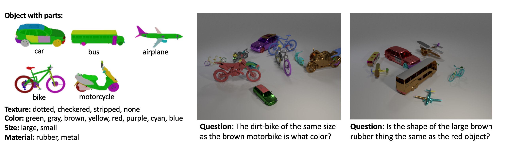

# Super-CLEVR dataset generation

## Michele Collevati

This repo is a fork and rework of [Super-CLEVR: A Virtual Benchmark to Diagnose Domain Robustness in Visual Reasoning](https://github.com/Lizw14/Super-CLEVR) (viewed online on Saturday, 14/10/2023), which in turn is based on [CLEVR Dataset Generation](https://github.com/facebookresearch/clevr-dataset-gen) (viewed online on Thursday, 12/10/2023).  

This is the code to generate the Super-CLEVR dataset. Super-CLEVR contains images of vehicles (from [UDA-Part](https://qliu24.github.io/udapart/)) randomly placed in the scenes. The vehicles have part annotations and so the objects in the images can have distinct part attributes. [Here](https://www.cs.jhu.edu/~zhuowan/zhuowan/SuperCLEVR/obj_part_list/all_objects.html) is the list of objects and parts in Super-CLEVR scenes.  

You can use this code to render synthetic images like this:  

<div align="center">
  
</div>

All CLEVR dataset generation code was originally developed and tested on OSX and Ubuntu 16.04. The OS of Super-CLEVR's rework of the original CLEVR code is unknown. We have modified some parts of Super-CLEVR code according to our needs in Ubuntu 22.04.3 LTS.


## Dataset generation

We render synthetic images using [Blender](https://www.blender.org), outputting both rendered images as well as a JSON file containing ground-truth scene information for each image.

1. Install [Blender 2.79b](https://download.blender.org/release/Blender2.79/blender-2.79b-linux-glibc219-x86_64.tar.bz2) and [Blender 3.6.4](https://download.blender.org/release/Blender3.6/).  

   Add Blender to the environment `PATH` (only one version at a time, keep the other one commented out). Add the following command to `~/.bashrc` pointing to the directory with Blender’s binary:  

   ```
   # Blender
   export PATH="/path/to/blender/directory:$PATH"
   ```

   Blender ships with its own installation of Python which is used to execute scripts that interact with Blender; you'll need to add the `image_generation` directory to Python path of Blender's bundled Python. The easiest way to do this is by adding a `.pth` file to the `site-packages` directory of Blender's Python, like this:  

   ```
   echo $PWD/image_generation >> $BLENDER/$VERSION/python/lib/python3.5/site-packages/superclevr.pth
   ```

   where `$BLENDER` is the directory where Blender is installed and `$VERSION` is your Blender version.
2. Download the [CGPart annotated 3D CAD models](https://cs.jhu.edu/~qliu24/CGPart/cgpart_3d.zip) and extract the `CGPart` folder to `../`.  

   See also [https://github.com/qliu24/render-3d-segmentation](https://github.com/qliu24/render-3d-segmentation) for more details.
3. Then, we want to preprocess the 3D models. To do this, run `sh scripts/preprocess_cgpart.sh` with Blender 2.79b (added to the environment `PATH`).
4. Next run `sh scripts/render_images.sh` with Blender 3.6.4 (added to the environment `PATH`) to render images with the GPU. Modify its argument values as per your needs. The results are saved in the `output` folder.
5. After the images and corresponding scene files are generated, run `python scripts/merge_scenes.py` to merge the scene files into one json file as `output/superCLEVR_scenes.json`. The file `output/superCLEVR_scenes.json` will contain ground-truth scene information for all newly rendered images.


## Additional notes

1. There is an error when Blender quits that shows the following error message:  
   
   ```
   Error: Not freed memory blocks: 2, total unfreed memory 0.005035 MB
   ```

   This error has not been resolved but does not compromise the correct functioning of the code.  

   See also [https://projects.blender.org/blender/blender/issues/44127](https://projects.blender.org/blender/blender/issues/44127) for more details.
2. 2 example images and scenes are in `output/images` and `output/scenes`.
3. Dataset scene files contain object bounding boxes.
